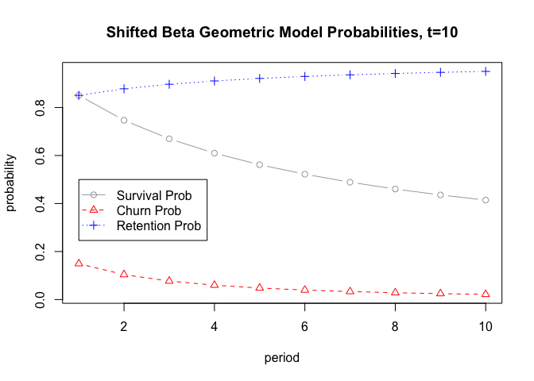

```{r setup, include=FALSE}
knitr::opts_chunk$set(echo = TRUE)
```

[](https://img.shields.io/badge/language-R-blue)
[](https://github.com/KobaKhit/eCLV/issues)
[](https://github.com/KobaKhit/eCLV/network)
[](https://github.com/KobaKhit/eCLV/stargazers)
[](https://github.com/KobaKhit/eCLV)


Collection of functions that compute Expected Customer Lifetime Value in a subscription (contractual) setting based on research by Fader and Hardie. More on [Rpubs](https://rpubs.com/Koba/projecting-clv).

<!-- -->


## Usage

We will use the example data from paper 1 in the references section.

```{r, warning=F}
# Load the functions
source("lib-BG.R")

# Example from paper
# Data
activeCust = c(869,743,653,593,551,517,491)
lostCust = c(131,126,90,60,42,34,26)

# Estimate the maximum likelihood function to get the alpha, beta values
# Alternative function to estimate MLL
# estimateMLL2(active.cust = activeCust,
#             lost.cust = lostCust)$par
alphabeta = estimateMLL(active.cust = activeCust,
            lost.cust = lostCust)$par

alphabeta

# Survival probabilities for 10 periods
periods = 1:10
sProb = survivalBG(alphabeta[1],alphabeta[2], periods)
# Churn probabilities for 10 periods
cProb = churnBG(alphabeta[1],alphabeta[2],periods)
# Get the retention rates for 10 periods
rProb = retentionRates(alphabeta[1],alphabeta[2],periods)
# create plot
dat = data.frame(sProb,cProb,rProb)
matplot(dat, type = c("b"), ylab = 'probability', xlab='period', 
        pch=1:3,col=c('darkgray','red','blue'), lty=1:3, 
        main='Shifted Beta Geometric Model Probabilities, t=10')
legend(x=1,y=0.5, legend=c("Survival Prob", "Churn Prob","Retention Prob"), 
       col=c('darkgray','red','blue'), lty=1:3, pch=1:3) 


sProb
cProb
rProb


# Discounted Expected Lifetime
DEL(alphabeta[1],alphabeta[2],discount = 0.1)

# Discounted Expected Residual Lifetime
DERL(alphabeta[1],alphabeta[2],discount = 0.1, renewals = 4)

# Expected Lifetime Value per customer assuming expected net cash flow is 100$ per period
DEL(alphabeta[1],alphabeta[2],discount = 0.1)*100

# Expected Residual Lifetime Value per customer who renewed 4 times
# assuming expected net cash flow is 100$ per period
DERL(alphabeta[1],alphabeta[2],renewals = 4, discount = 0.1)*100
```

## References

1. [How to Project Customer Retention](https://faculty.wharton.upenn.edu/wp-content/uploads/2012/04/Fader_hardie_jim_07.pdf) by Peter Fader and Bruce Hardie (2007)

2. [Fitting the sBG Model to Multi-Cohort Data](http://brucehardie.com/notes/017/) by Peter Fader and Bruce Hardie (2007)
